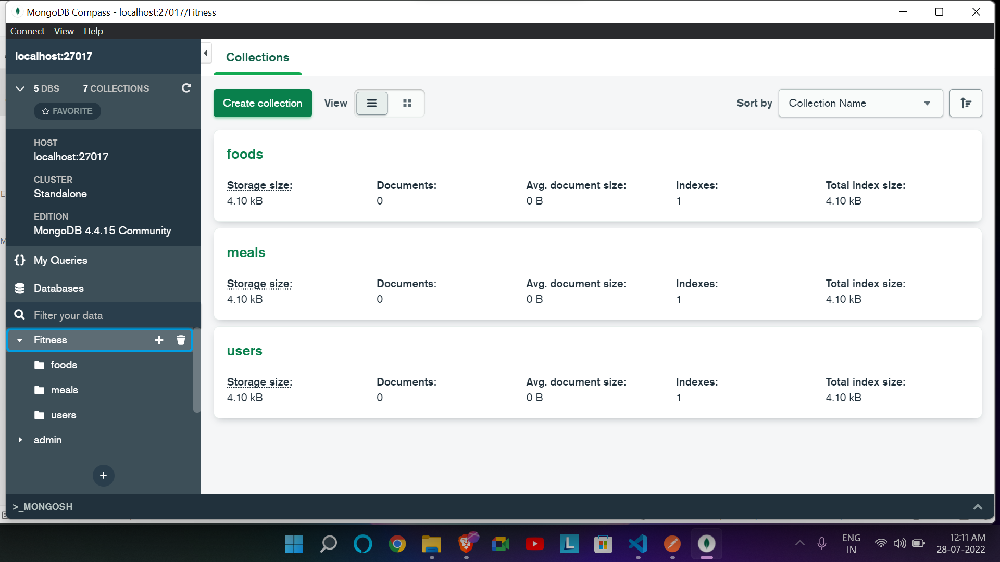
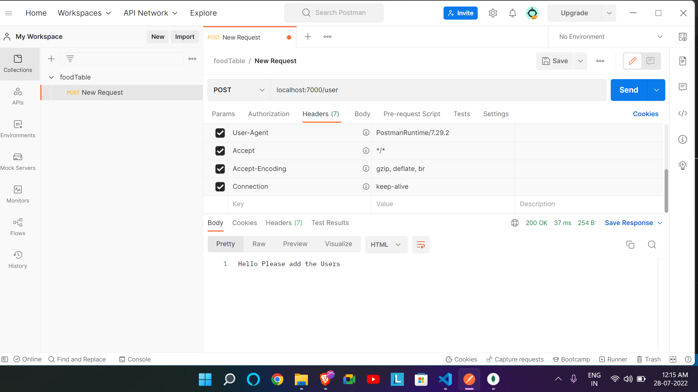
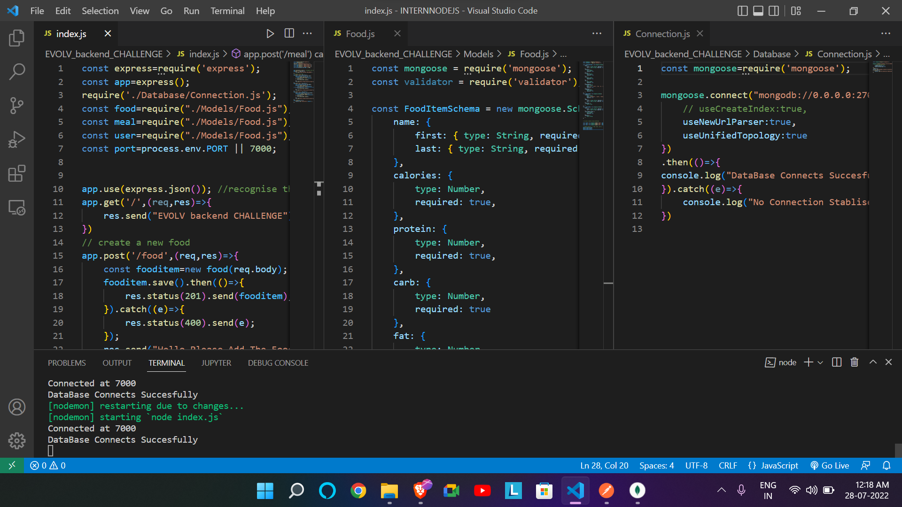

# EvolvFit
Level-1

Connected Succesfully to MongoDb

Working Good in :

1: POST in POSTMAN for food

2: POST in POSTMAN for meal

3: POST in POSTMAN for user

Successfully Connection establised with DataBase and ExpressJs

